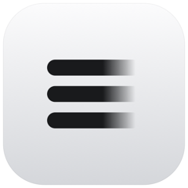

<div align="center">



# Nvisy Server

**Detect and redact sensitive data across documents, images, and audio.**

The open-source multimodal redaction API: an LLM-powered engine and HTTP service
that finds PII and applies your redaction policies, wrapped in a multi-tenant,
self-hostable Rust server.

[](https://github.com/nvisycom/server/actions/workflows/build.yml)
[](https://github.com/nvisycom/server/actions/workflows/release.yml)
[](https://github.com/nvisycom/server/actions/workflows/security.yml)
[](LICENSE.txt)

[**nvisy.com**](https://nvisy.com) · [**docs.nvisy.com**](https://docs.nvisy.com) · [**app.nvisy.com**](https://app.nvisy.com)

</div>

A document flows through two phases: **detection** analyzes it for sensitive
entities and stores a reviewable report; **redaction** applies the pipeline's
policies (with optional reviewer edits) to produce a redacted file. Detection
runs asynchronously off a transactional work queue; redaction is synchronous and
repeatable. Everything is scoped to isolated workspaces with per-workspace
credential encryption.

> [!WARNING]
> **Active development. API not stable.** Public APIs, configuration shapes,
> on-disk formats, and wire protocols may change without notice between releases.
> Pin a specific commit if you depend on this in production.

## Features

- **Multimodal redaction** — detect and remove sensitive data across PDFs, office documents, images, and audio.
- **AI-powered detection** — LLM- and pattern-driven PII/entity recognition, governed by configurable redaction policies.
- **Reviewer edits** — suppress a false positive, retag a detection, or add one the analysis missed, then re-redact — as many times as needed.
- **Workspace isolation** — multi-tenant workspaces with HKDF-derived, per-workspace credential encryption.
- **Real-time collaboration** — WebSocket and NATS pub/sub for live status and document editing.
- **Interactive docs** — auto-generated OpenAPI served through a Scalar UI.

## Requirements

- **Rust + Cargo** — 1.95+, Edition 2024
- **PostgreSQL** 18+, **NATS** 2.10+ (JetStream), and an **S3-compatible blob store** (RustFS by default) — the dev compose file provides all three

## Quick start

The fastest way to get started is with [Nvisy Cloud](https://nvisy.com). To run a
server locally:

```bash
make install-all       # Install tools and make scripts executable
make generate-all      # Generate .env, auth keys, and apply migrations

docker compose -f docker/docker-compose.dev.yml up -d   # Start Postgres, NATS, RustFS
make run                                                # Run the server
```

The API then serves interactive OpenAPI docs (Scalar UI) at the running server's
docs path. For self-hosted deployments, see [`docker/`](docker/) for compose
files and infrastructure requirements, and [`.env.example`](.env.example) for
configuration.

## Commands

| Command | What it does |
| --- | --- |
| `make run` | Run the server (starts Postgres, NATS, and RustFS first) |
| `make ci` | Run all CI checks locally (check, fmt, clippy, test, docs) |
| `make fmt` | Fix code formatting (nightly rustfmt) |
| `make security` | Run security checks (`cargo deny`) |
| `make generate-migrations` | Apply migrations and regenerate `schema.rs` |
| `make reset-docker` | Reset the dev containers (`down -v`, then `up -d`) |

## Documentation

See [`docs/`](docs/) for the details:

- [Architecture](docs/ARCHITECTURE.md) — the crates, the detect/redact pipeline, and how they fit together.
- [Intelligence](docs/INTELLIGENCE.md) — detection capabilities and the redaction engine.
- [Providers](docs/PROVIDERS.md) — inference and object-store provider design.
- [Security](docs/SECURITY.md) — the encryption, authentication, and isolation model.

## Contributing

See [CONTRIBUTING.md](CONTRIBUTING.md) for development setup and guidelines, and
[CHANGELOG.md](CHANGELOG.md) for release notes.

## License

Apache 2.0 License, see [LICENSE.txt](LICENSE.txt).

## Support

- **Documentation**: [docs.nvisy.com](https://docs.nvisy.com)
- **Email**: [support@nvisy.com](mailto:support@nvisy.com)
